# Nabla Enterprise Runner Service

A containerized build service for firmware projects that supports multiple build systems and toolchains.

```mermaid
architecture-beta
    title FedRAMP Production

    group identity_plane[Identity]
    group key_plane[Key Management]
    group audit_plane[Audit]
    group vpc_main[Prod VPC]
    group app_tier[App Tier]
    group default_vpc[Default VPC]
    group external[External]

    service aws_iam_role_ec2_instance_role(logos:aws-iam)[EC2 Role] in identity_plane
    service aws_kms_key_main_key(logos:aws-kms)[CMK] in key_plane
    service aws_cloudwatch_log_group_application_logs(logos:aws-cloudwatch)[App Logs] in audit_plane
    service aws_cloudtrail_main_trail(logos:aws-cloudtrail)[CloudTrail] in audit_plane

    service aws_vpc_main(logos:aws-vpc)[Prod VPC] in external
    service aws_subnet_private_app_a(logos:aws-subnet)[App Subnet] in vpc_main
    service aws_subnet_private_db_a(logos:aws-subnet)[DB Subnet] in vpc_main
    service aws_subnet_public_a(logos:aws-subnet)[Public Subnet] in vpc_main
    service aws_internet_gateway_main(logos:aws-route53)[IGW] in vpc_main
    service aws_nat_gateway_main(logos:aws-route53)[NAT] in default_vpc

    service aws_security_group_web_tier(logos:aws-shield)[Web SG] in vpc_main
    service aws_security_group_app_tier(logos:aws-shield)[App SG] in vpc_main
    service aws_security_group_database_tier(logos:aws-shield)[DB SG] in vpc_main

    service aws_instance_web_server(logos:aws-ec2)[Web Server] in app_tier
    service aws_instance_app_server(logos:aws-ec2)[App Server] in app_tier
    service aws_db_instance_main_database(logos:aws-rds)[Database] in app_tier

    aws_subnet_private_app_a:L -- R:aws_vpc_main
    aws_subnet_private_db_a:L -- R:aws_vpc_main
    aws_subnet_public_a:L -- R:aws_vpc_main
    aws_internet_gateway_main:L -- R:aws_vpc_main
    aws_nat_gateway_main:L -- R:aws_subnet_public_a
    aws_security_group_web_tier:L -- R:aws_vpc_main
    aws_security_group_app_tier:L -- R:aws_vpc_main
    aws_security_group_database_tier:L -- R:aws_vpc_main
    aws_instance_web_server:L -- R:aws_subnet_private_app_a
    aws_instance_web_server:L -- R:aws_security_group_web_tier
    aws_instance_app_server:L -- R:aws_subnet_private_app_a
    aws_instance_app_server:L -- R:aws_security_group_app_tier
    aws_db_instance_main_database:L -- R:aws_security_group_database_tier
    aws_db_instance_main_database:L -- R:aws_kms_key_main_key
    aws_cloudwatch_log_group_application_logs:L -- R:aws_kms_key_main_key
    aws_cloudtrail_main_trail:L -- R:aws_kms_key_main_key
```



## Overview

The runner service accepts repository contents via HTTP (as ZIP or BASE64), detects the build system, compiles the firmware, and uploads the resulting artifacts back to a specified URL.

## Supported Build Systems

- **Cargo** (Rust)
- **Makefile** (Make)
- **CMake**
- **PlatformIO**
- **Zephyr West**
- **STM32CubeIDE** (with Makefile generation)
- **SCons**

## Pre-installed Toolchains

The Docker image includes:
- Rust toolchain (stable)
- GCC/G++ compilers
- CMake and Ninja
- PlatformIO
- Zephyr West
- ARM GCC toolchain (gcc-arm-none-eabi)
- SCons
- Python 3 with Flask

## API Usage

### Endpoint: `POST /build`

#### Content Types Supported:
- `application/zip` - Direct ZIP file upload
- `application/base64` - BASE64-encoded ZIP file
- `text/plain` - BASE64-encoded ZIP file (alternative)

#### Query Parameters:
- `archive_url` (required) - URL to repository archive (tar.gz)
- `owner` (required) - Repository owner
- `repo` (required) - Repository name  
- `installation_id` (required) - GitHub App installation ID
- `upload_url` (required) - URL to upload build artifacts

#### Example Requests:

**ZIP Upload:**
```bash
curl -X POST "http://localhost:8080/build?archive_url=https://github.com/myorg/firmware/archive/abc123.tar.gz&owner=myorg&repo=firmware&installation_id=12345&upload_url=https://api.example.com/upload" \
  -H "Content-Type: application/zip" \
  --data-binary @repo.zip
```

**BASE64 Upload:**
```bash
# First encode your ZIP file
base64 repo.zip > repo.b64

curl -X POST "http://localhost:8080/build?archive_url=https://github.com/myorg/firmware/archive/abc123.tar.gz&owner=myorg&repo=firmware&installation_id=12345&upload_url=https://api.example.com/upload" \
  -H "Content-Type: application/base64" \
  --data-binary @repo.b64
```

#### Response:
- `202 Accepted` - Build started successfully
- `400 Bad Request` - Invalid parameters or malformed request
- `413 Payload Too Large` - Repository exceeds 200MB limit
- `415 Unsupported Media Type` - Invalid Content-Type
- `500 Internal Server Error` - Build failed

Response body includes build logs (last 4000 characters).

## Build Process

1. **Extract** - Repository ZIP is extracted to `/workspace/repo`
2. **Detect** - Build system is auto-detected using `detection.rs`
3. **Build** - Build executed using `execution.rs` with proper toolchain
4. **Package** - Build artifact is packaged as ZIP
5. **Upload** - Artifact is uploaded via HTTP to the specified URL

## Architecture

The service uses a **hybrid Python + Rust architecture**:

- **Python Flask server** (`server.py`) - Handles HTTP requests and BASE64/ZIP decoding
- **Rust binary** (`nabla-runner`) - Performs build detection, execution, and artifact handling
- **Pre-installed toolchains** - All build tools available in the container

This approach provides:
- ✅ **Type safety** - Rust handles complex build logic
- ✅ **Code reuse** - Shares detection/execution logic with other components
- ✅ **Performance** - Async Rust execution with structured error handling
- ✅ **Maintainability** - Single source of truth for build systems

## Deployment

### Local Development:
```bash
docker build -t nabla-runner .
docker run -p 8080:8080 nabla-runner
```

### Google Cloud Run:
```bash
# Build and push to Container Registry
gcloud builds submit --tag gcr.io/PROJECT_ID/nabla-runner

# Deploy to Cloud Run
gcloud run deploy nabla-runner \
  --image gcr.io/PROJECT_ID/nabla-runner \
  --platform managed \
  --region us-central1 \
  --memory 4Gi \
  --timeout 3600 \
  --max-instances 10
```

## Configuration

### Environment Variables:
- `PORT` - HTTP server port (default: 8080)
- `MAX_UPLOAD` - Maximum upload size in bytes (default: 200MB)

### Resource Requirements:
- **Memory**: 2-4GB recommended
- **CPU**: 1-2 vCPUs
- **Timeout**: 60 minutes for complex builds
- **Storage**: Ephemeral, no persistent storage needed

## Error Codes

Build script exit codes:
- `2` - Missing required environment variables
- `3` - Repository ZIP not found
- `4` - Failed to extract ZIP archive
- `10-19` - Build system specific failures
- `20` - Unsupported/undetected build system
- `21` - Build completed but artifact not found
- `30` - Upload failed

## Security Considerations

- Repository contents are processed in isolated containers
- No persistent storage of user data
- Build artifacts are uploaded immediately and not retained
- Container runs with non-root user for build execution
- Input validation on all parameters

## Example Client

See `example_client.py` for a complete Python example demonstrating both ZIP and BASE64 upload methods.
